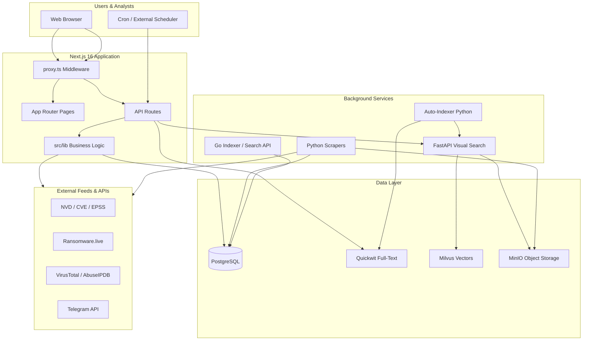
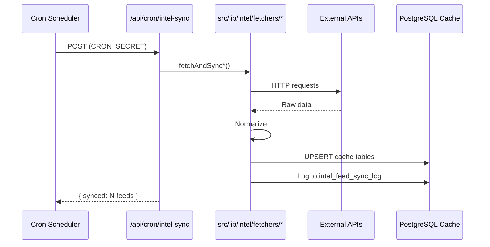
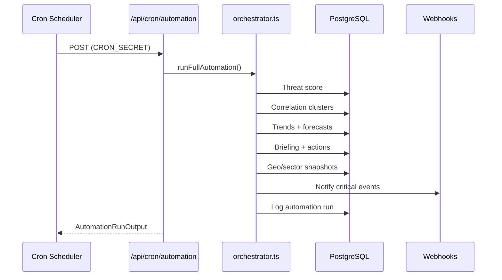
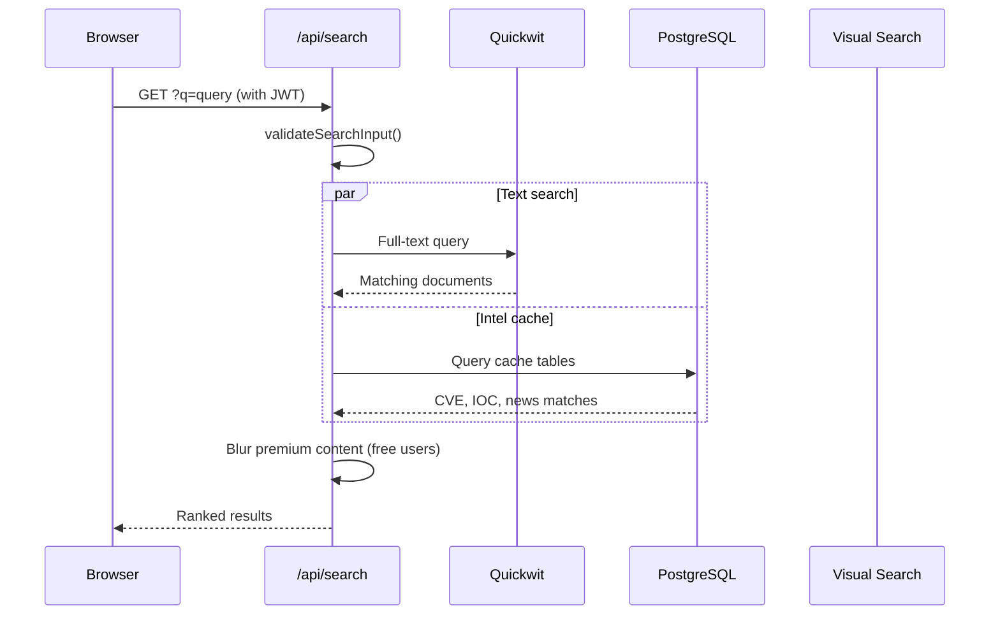

# IntelForge — Complete Codebase Deep Structure

> **IntelForge** (also branded *Intel Forge*) is a full-stack Cyber Threat Intelligence (CTI) and Open-Source Intelligence (OSINT) SaaS platform built as a Final Year Project. This document explains every major part of the codebase: what it does, how it connects, and where to find it.

---

## Table of Contents

1. [Executive Summary](#1-executive-summary)
2. [High-Level Architecture](#2-high-level-architecture)
3. [Technology Stack](#3-technology-stack)
4. [Repository Directory Tree](#4-repository-directory-tree)
5. [Next.js Application (`src/`)](#5-nextjs-application-src)
6. [Intelligence Modules (30+)](#6-intelligence-modules-30)
7. [Automation Pipeline](#7-automation-pipeline)
8. [API Reference (Grouped)](#8-api-reference-grouped)
9. [Core Backend Libraries (`src/lib/`)](#9-core-backend-libraries-srclib)
10. [React Components (`src/components/`)](#10-react-components-srccomponents)
11. [Database Schema](#11-database-schema)
12. [Scrapers & Data Collection](#12-scrapers--data-collection)
13. [Indexers & Search Infrastructure](#13-indexers--search-infrastructure)
14. [Authentication & Security](#14-authentication--security)
15. [Middleware & Request Flow](#15-middleware--request-flow)
16. [Multi-Tenancy & Organizations](#16-multi-tenancy--organizations)
17. [Integrations (MISP, SIEM, Webhooks)](#17-integrations-misp-siem-webhooks)
18. [Environment Variables](#18-environment-variables)
19. [Docker & Deployment](#19-docker--deployment)
20. [Testing & Quality Assurance](#20-testing--quality-assurance)
21. [Documentation & Diagrams](#21-documentation--diagrams)
22. [Data Flow Diagrams](#22-data-flow-diagrams)
23. [Operational Health Notes](#23-operational-health-notes)
24. [Quick Reference Commands](#24-quick-reference-commands)

---

## 1. Executive Summary

IntelForge gives security analysts a single place to:

- **Monitor** global cyber threats (CVEs, ransomware, phishing, dark web, malware, APT campaigns)
- **Correlate** events automatically into threat clusters and attack chains
- **Prioritize** patching and hunting via threat scores, forecasts, and action queues
- **Search** billions of OSINT records (breach data, stealer logs, paste sites, Telegram, etc.)
- **Identify** faces and images across scraped social media
- **Collaborate** on cases, watchlists, and investigations
- **Integrate** with MISP, SIEM, and webhooks

The platform is **multi-service**:

| Service | Role |
|---------|------|
| **Next.js 16** | Web UI + REST API (primary application) |
| **PostgreSQL 16** | Users, intel cache, automation state |
| **Quickwit** | Full-text search over OSINT files |
| **Milvus + MinIO** | Vector/face/image similarity search |
| **Python scrapers** | Telegram, Threads, forums, Ahmia, face pipelines |
| **Go indexer** | Line-level file indexing + search API |
| **FastAPI visual search** | CLIP/ArcFace similarity microservice |

---

## 2. High-Level Architecture



### Request lifecycle (simplified)

1. User hits a page or API route.
2. `proxy.ts` applies security headers, rate limits, admin alias routing, JWT checks.
3. Page components (React Server Components) or API handlers call `src/lib/*`.
4. Lib modules read/write PostgreSQL cache tables or call external services.
5. Cron jobs (`/api/cron/*`) sync feeds and run the automation pipeline on a schedule.

---

## 3. Technology Stack

| Layer | Technology | Version / Notes |
|-------|------------|-----------------|
| Framework | Next.js (App Router) | 16.x — requires `--webpack` flag |
| UI | React | 19.x |
| Language | TypeScript | 5.x |
| Styling | Tailwind CSS | 4.x |
| UI primitives | shadcn/ui + Radix | ~45 components |
| Charts | Recharts | Threat gauges, forecast charts |
| Database | PostgreSQL | 16 — via `pg` pool |
| Auth | JWT + cookies | Access + refresh tokens, 2FA (speakeasy) |
| Search (text) | Quickwit | Port 7280 |
| Search (vector) | Milvus | Port 19530 |
| Object storage | MinIO | Images for visual search |
| Go services | Chi router | search-api, indexer CLI |
| Python | 3.10+ | Scrapers, auto-indexer, FastAPI |
| PDF | PDFKit | Briefing exports, face dossiers |
| Validation | Zod | Request schemas |
| Email | Nodemailer | SMTP alerts |
| Cache (optional) | Redis (ioredis) | Search result caching |

---

## 4. Repository Directory Tree

```
intelforge/  (project root: code/)
│
├── src/                          # All Next.js application source
│   ├── app/                      # Pages + API routes (App Router)
│   ├── components/               # React UI components
│   ├── hooks/                    # Custom React hooks
│   ├── lib/                      # Backend logic, intel, auth, security
│   ├── tests/                    # 13 defence test suites
│   └── AGENTS.md                 # AI/coding conventions
│
├── scrapers/                     # Python data collection services
│   ├── services/                 # face_scraper, image_indexer, forum_monitor, etc.
│   ├── telegram-scraper/
│   ├── visual-search/            # FastAPI microservice
│   └── threadcoreface/           # Standalone Threads OSINT tool
│
├── indexer/                      # Go + Python indexing
│   ├── cmd/search-api/           # HTTP search API
│   ├── cmd/indexer/              # CLI file indexer
│   ├── internal/                 # Go packages
│   └── quickwit-config/          # Quickwit index schemas
│
├── data/                         # OSINT data files (scraped, leaks, samples)
│   ├── intel/                    # Aggregated intel (DNS/IP/cert)
│   ├── scraped/                  # forums, github, paste, reddit, telegram, twitter
│   ├── leaks/, stealer_logs/, ulp/
│   └── image/                    # Sample images for visual search
│
├── userfiles/                    # User uploads & generated exports
│   ├── uploads/, exports/, reports/, profiles/
│
├── scripts/                      # DB schema, migrations, seeds, utilities
├── docs/                         # FYP docs, defence materials, presentations
├── diagram/                      # 23 PlantUML architecture diagrams
│
├── proxy.ts                      # Next.js middleware (auth, security, rate limit)
├── package.json
├── go.mod                        # Go module for indexer
├── docker-compose.quickwit.yml   # Full infrastructure stack
├── .env.example                  # Environment template
├── README.md
└── SETUP.md
```

---

## 5. Next.js Application (`src/`)

### 5.1 App Router structure

Next.js 16 uses the **App Router**: each folder under `src/app/` with a `page.tsx` becomes a URL route. API routes use `route.ts` files.

```
src/app/
├── layout.tsx              # Root layout (fonts, theme, providers)
├── page.tsx                # Landing page (/)
├── globals.css             # Global styles
│
├── login/                  # User login
├── register/               # User registration
│
├── search/                 # Global OSINT search (text, face, image)
├── dashboard/              # User dashboard + sub-pages
├── cases/                  # Investigation cases
├── reports/                # Generated reports
│
├── intelligence/           # 30+ CTI modules (main product)
├── intel/                  # Entity detail pages (/intel/[type]/[value])
│
├── admin/                  # Admin panel (internal path /admin)
├── api/                    # 137+ REST API endpoints
├── api-docs/               # OpenAPI documentation UI
│
├── about/, pricing/, news/, help/
├── terms/, privacy/, acceptable-use/
└── documentation/
```

### 5.2 Public & marketing pages

| Route | File | Purpose |
|-------|------|---------|
| `/` | `page.tsx` | Landing: hero, trusted companies, footer |
| `/about` | `about/page.tsx` | About the platform |
| `/pricing` | `pricing/page.tsx` | Subscription tiers |
| `/news` | `news/page.tsx` | Public news feed |
| `/help` | `help/page.tsx` | Help center |
| `/api-docs` | `api-docs/page.tsx` | Interactive API documentation |
| `/terms`, `/privacy`, `/acceptable-use` | Legal pages | Compliance |

### 5.3 Authentication pages

| Route | Purpose |
|-------|---------|
| `/login` | Email/password login, Google OAuth, 2FA challenge |
| `/register` | New user registration with password validation |
| `/admin/login` | Admin-specific login (also aliased — see Security) |

**Default admin** (seeded by migrations): `admin@intelforge.com` — change password after first login. See [SETUP.md](SETUP.md).

### 5.4 User dashboard

| Route | Purpose |
|-------|---------|
| `/dashboard` | Main user home: quota, recent activity |
| `/dashboard/monitoring` | Watchlist alerts and monitoring items |
| `/dashboard/investigations` | Case/investigation management |
| `/dashboard/organizations` | Multi-org membership and switching |
| `/dashboard/integrations` | Webhooks, MISP, SIEM connectors |
| `/dashboard/settings/white-label` | Tenant branding customization |

### 5.5 Search & investigations

| Route | Purpose |
|-------|---------|
| `/search` | Global search UI: text, face, image modes; filters; premium blur |
| `/cases` | List of investigation cases |
| `/cases/[id]` | Single case detail with linked intel |
| `/reports` | User-generated intel reports |

### 5.6 Intel entity pages

| Route | Purpose |
|-------|---------|
| `/intel/[type]/[value]` | Unified entity view (CVE, domain, IP, actor, etc.) |
| `/intel/findings/[id]` | Single finding detail |
| `/intel/ai-analyst` | AI Analyst Workspace (note: hub links to `/intelligence/ai-analyst` which 404s — use `/intel/ai-analyst`) |

### 5.7 Admin panel (`src/app/admin/`)

Accessible via **`/admin-portal`** alias (see middleware). Direct `/admin` redirects to alias.

| Route | Purpose |
|-------|---------|
| `/admin` | Admin dashboard stats |
| `/admin/users` | User management |
| `/admin/subscriptions` | Subscription plans |
| `/admin/api-keys` | API key management |
| `/admin/search-logs` | Search audit logs |
| `/admin/audit-logs` | Security audit trail |
| `/admin/security` | IP policies, login activity |
| `/admin/settings` | SMTP, system settings |
| `/admin/news` | News content management |
| `/admin/automation` | Run automation pipeline, view runs |
| `/admin/demo-corpus` | Demo data seeding for defence |
| `/admin/intel-sources` | Intel feed source config |
| `/admin/darkweb-sources` | Dark web source config |
| `/admin/data-sources` | OSINT data directory config |
| `/admin/resellers` | Reseller/white-label clients |
| `/admin/feedback` | User feedback |

---

## 6. Intelligence Modules (30+)

The intelligence hub lives at **`/intelligence`**. Each module is a dedicated page under `src/app/intelligence/<module>/page.tsx` backed by fetchers in `src/lib/intel/fetchers/` and cache tables in PostgreSQL.

### 6.1 Automation & command modules

| Module | Route | What it does |
|--------|-------|--------------|
| **Command Center** | `/intelligence/command-center` | Live global threat score (0–100), executive briefing, correlated clusters, trend metrics, 7-day forecasts, anomalies, geo heatmap, sector risk index, top action queue items, SSE live score stream, PDF export |
| **Action Queue** | `/intelligence/action-queue` | Auto-generated analyst tasks (patch, hunt, block, review) with priority, status, comments, bulk actions |
| **Executive Briefings** | `/intelligence/briefings` | Archive of daily auto-generated threat briefs with headline, drivers, recommended actions |
| **Correlation** | `/intelligence/clusters` | View auto-correlated threat clusters (CVE-anchored, ransomware-anchored, etc.) |
| **Hunt Builder** | `/intelligence/hunt` | Build hunts across clusters, actors, CVEs with scoped queries |
| **Deep Search** | `/intelligence/deep-search` | Cross-source entity search (breach, CVE, actor, dark web, stealer logs) |

### 6.2 Vulnerability & exploit intelligence

| Module | Route | Data sources | Cache table |
|--------|-------|--------------|-------------|
| **CVE Intelligence** | `/intelligence/cve` | NVD, EPSS, CISA KEV | `intel_cve_cache` |
| **Exploit Intelligence** | `/intelligence/exploits` | Exploit-DB, GitHub PoCs | `intel_exploit_cache` |
| **Vuln Prioritization** | `/intelligence/vuln-prioritize` | Composite: CVSS + EPSS + KEV + exploit availability | `intel_cve_cache` |
| **Supply Chain Intel** | `/intelligence/supply-chain` | OSV.dev (NPM, PyPI, Maven, Go) | `intel_supply_chain_cache` |

### 6.3 Threat actor & campaign intelligence

| Module | Route | Data sources | Cache table |
|--------|-------|--------------|-------------|
| **Threat Actors** | `/intelligence/threat-actors` | MITRE ATT&CK groups | `intel_mitre_groups` |
| **Attack Patterns** | `/intelligence/attack-patterns` | MITRE techniques matrix | `intel_mitre_techniques` |
| **APT Campaigns** | `/intelligence/apt-campaigns` | Curated campaign timelines | `intel_apt_campaigns` |
| **Actor Relationships** | `/intelligence/actor-relationships` | Overlap analysis (techniques, malware, sectors) | Multiple tables |
| **Actor Report** | `/intelligence/actor-report` | Deep-dive actor dossiers | Fetcher + cache |
| **Intel Graph** | `/intelligence/relationship-graph` | Force-directed graph: actors ↔ malware ↔ CVEs | `intel_relationships` |

### 6.4 Malware, IOC & detection

| Module | Route | Data sources | Cache table |
|--------|-------|--------------|-------------|
| **IOC Lookup** | `/intelligence/ioc-search` | VirusTotal, AbuseIPDB, GreyNoise, OTX, local cache | `intel_ioc_lookups` |
| **Bulk IOC** | `/intelligence/bulk-ioc` | Correlate up to 100 IOCs across all tables | Multiple |
| **Malware Intelligence** | `/intelligence/malware` | MalwareBazaar, URLhaus | `intel_malware_cache` |
| **Sigma Rules** | `/intelligence/sigma` | SigmaHQ curated rules | `intel_sigma_rules` |
| **YARA Repository** | `/intelligence/yara` | Curated YARA rules | `intel_yara_rules` |
| **Detection Coverage** | `/intelligence/detection-coverage` | MITRE ↔ Sigma/YARA gap analysis | `intel_sigma_rules`, `intel_yara_rules`, `intel_mitre_techniques` |

### 6.5 Ransomware & dark web

| Module | Route | Data sources | Cache table |
|--------|-------|--------------|-------------|
| **Ransomware Tracker** | `/intelligence/ransomware` | Ransomware.live groups & victims | `intel_ransomware_groups`, `intel_ransomware_victims` |
| **Dark Web Monitor** | `/intelligence/darknet` | Ransomware blogs, forum scrapes | `intel_darknet_posts` |

### 6.6 Domain & attack surface

| Module | Route | Data sources | Cache table |
|--------|-------|--------------|-------------|
| **Domain Intelligence** | `/intelligence/cert-domain` | Certificate Transparency (crt.sh) | `intel_cert_cache` |
| **Typosquatting** | `/intelligence/typosquatting` | Homoglyph/brand impersonation detection | `intel_typosquat_cache` |
| **GitHub Secrets** | `/intelligence/github-secrets` | Exposed API keys in public repos | `intel_github_secrets` |
| **Phishing Intelligence** | `/intelligence/phishing` | OpenPhish, PhishTank | `intel_phishing_cache` |
| **Attack Surface** | `/intelligence/attack-surface` | Consolidated domain report: certs, typosquats, secrets, phishing | Multiple |
| **Risk Profiler** | `/intelligence/risk-profiler` | Enter tech stack → relevant CVEs & supply chain risks | Multiple |

### 6.7 News, health & AI

| Module | Route | Purpose |
|--------|-------|---------|
| **Cyber News** | `/intelligence/news` | Aggregated cybersecurity news |
| **Feed Health** | `/intelligence/feed-health` | Data freshness, record counts, sync status per feed |
| **Watchlists** | `/intelligence/watchlists` | Track CVEs, domains, actors — get notified on new intel |
| **AI Analyst** | `/intel/ai-analyst` | Natural-language CTI queries across all intel sources |

### 6.8 Intelligence hub dashboard (`/intelligence`)

The hub page aggregates:

- **Threat score gauge** (from automation)
- **12 stat cards** (critical CVEs, KEV count, active ransomware groups, victims, threat actors, news, malware, phishing, darknet, YARA, APT campaigns)
- **Quick access** links to top modules
- **Featured modules** grid
- **Latest cyber news** sidebar
- **Critical CVEs** sidebar

Data is loaded server-side via `query()` from PostgreSQL cache tables.

---

## 7. Automation Pipeline

The automation layer (`src/lib/intel/automation/`) transforms IntelForge from a passive feed viewer into a **self-running CTI platform**. It reads only from the local PostgreSQL cache — never upstream APIs at request time.

### 7.1 Pipeline stages (orchestrator)

`orchestrator.ts` → `runFullAutomation()` executes these steps in order (each isolated — failure in one does not stop others):

```
┌─────────────────┐
│ 1. Threat Score │  computeAndPersistThreatScore()
├─────────────────┤
│ 2. Correlation  │  runCorrelationPass() + runDeepCorrelationPass()
├─────────────────┤
│ 3. Trends       │  captureTrends()
├─────────────────┤
│ 4. Briefing     │  generateDailyBriefing()
├─────────────────┤
│ 5. Forecasts    │  generateForecastsAndAnomalies()
├─────────────────┤
│ 6. Actions      │  generateActions()
├─────────────────┤
│ 7. Geo/Sector   │  captureGeoAndSector()
├─────────────────┤
│ 8. Notify       │  notifyBriefing(), notifyAnomalies(), notifyCriticalClusters()
├─────────────────┤
│ 9. Backtest     │  runForecastBacktest()
├─────────────────┤
│10. Attribution  │  attributeRecentAnomalies()
└─────────────────┘
```

Each run is logged to `intel_automation_runs` with status, duration, and JSON output.

### 7.2 Module reference

| File | Responsibility |
|------|----------------|
| `threat-score.ts` | Composite 0–100 score from KEV count, critical CVEs, ransomware victims, phishing, darknet activity. Severity tiers: low/medium/high/critical. 24h delta. |
| `correlator.ts` | v1: Walks recent CVEs, merges exploits, news, KEV flags into `intel_correlation_clusters` |
| `correlator-v2.ts` | v2: Multi-anchor clusters (CVE, ransomware, actor) with rich signal types and confidence scores |
| `correlator-nlp.ts` | Alias matching, fuzzy description matching for deeper links |
| `trends.ts` | Daily metric counters with percent delta and "emerging" flags |
| `forecast.ts` | Holt linear exponential smoothing for 7-day forecasts; Z-score anomaly detection |
| `forecast-backtest.ts` | MAPE accuracy tracking for naive vs Holt vs Holt-Winters |
| `geo-sector.ts` | Per-country and per-sector risk index from victims, phishing, darknet |
| `action-queue.ts` | Auto-generated patch/hunt/review tasks; idempotent via `action_key` |
| `action-collab.ts` | Comments, assignments, audit trail on actions |
| `briefing-generator.ts` | Deterministic daily narrative from pipeline outputs |
| `briefing-llm.ts` | Optional LLM rewrite of briefing summary |
| `briefing-pdf.ts` | PDFKit A4 PDF export |
| `notifications.ts` | Webhook dispatch for critical events |
| `anomaly-attribution.ts` | Links anomalies to root causes (`caused_by` JSONB) |
| `events.ts` | PostgreSQL LISTEN/NOTIFY for SSE live updates |
| `cron-rate-limit.ts` | Rate limits cron endpoints (429 after 10 calls) |
| `openapi.ts` | OpenAPI 3.1 spec generation |

### 7.3 Cron endpoints

| Endpoint | Purpose | Auth |
|----------|---------|------|
| `POST /api/cron/intel-sync` | Sync all intel fetchers to cache | `CRON_SECRET` |
| `POST /api/cron/automation` | Run full automation pipeline | `CRON_SECRET` |
| `POST /api/cron/monitoring` | Check user watchlists | `CRON_SECRET` |
| `POST /api/cron/intel` | Legacy intel cron | `CRON_SECRET` |

### 7.4 Automation API (read)

| Endpoint | Returns |
|----------|---------|
| `GET /api/intel/automation/status` | Threat score, history, clusters, trends, briefing |
| `GET /api/intel/automation/briefings` | Briefing archive |
| `GET /api/intel/automation/briefings/export` | PDF download |
| `GET /api/intel/automation/forecasts` | 7-day forecasts + anomalies |
| `GET /api/intel/automation/forecast-accuracy` | Backtest MAPE results |
| `GET /api/intel/automation/geo` | Geographic + sector snapshots |
| `GET /api/intel/automation/clusters` | Correlation clusters (filterable by type) |
| `GET /api/intel/automation/actions` | Action queue (filterable by status, category, search) |
| `PATCH /api/intel/automation/actions` | Update action status (auth required) |
| `GET /api/intel/automation/stream` | SSE live threat score events |

---

## 8. API Reference (Grouped)

There are **137+ API route files** under `src/app/api/`. Below is a logical grouping.

### 8.1 Authentication (`/api/auth/`)

| Endpoint | Method | Purpose |
|----------|--------|---------|
| `/api/auth/login` | POST | Email/password login → JWT cookies |
| `/api/auth/admin-login` | POST | Admin-specific login |
| `/api/auth/register` | POST | New user registration |
| `/api/auth/logout` | POST | Clear session cookies |
| `/api/auth/refresh` | POST | Refresh access token |
| `/api/auth/me` | GET | Current user profile |
| `/api/auth/google/callback` | GET | Google OAuth callback |
| `/api/auth/2fa/setup` | POST | Initialize 2FA |
| `/api/auth/2fa/verify` | POST | Verify 2FA setup |
| `/api/auth/2fa/verify-login` | POST | 2FA challenge during login |
| `/api/auth/2fa/disable` | POST | Disable 2FA |

### 8.2 Search (`/api/search/`)

| Endpoint | Purpose |
|----------|---------|
| `/api/search` | Main text search (auth required for full results) |
| `/api/search/stream` | Streaming search results |
| `/api/search/export` | Export search results |
| `/api/search/ai-analysis` | AI-powered result analysis |
| `/api/search/visual` | Visual/image similarity search |
| `/api/search/face` | Face similarity search |
| `/api/search/face/analyze` | Face detection analysis |
| `/api/search/face/bulk` | Bulk face search |
| `/api/search/face/export` | Export face search results |
| `/api/search/face/history` | Face search history |

### 8.3 Intel feeds (`/api/intel/`)

One route per intelligence module, e.g.:

- `/api/intel/cve`, `/api/intel/ransomware`, `/api/intel/malware`, `/api/intel/ioc`
- `/api/intel/phishing`, `/api/intel/typosquatting`, `/api/intel/supply-chain`
- `/api/intel/darknet`, `/api/intel/apt-campaigns`, `/api/intel/sigma`, `/api/intel/yara`
- `/api/intel/threat-actors`, `/api/intel/attack-patterns`, `/api/intel/exploits`
- `/api/intel/cert-transparency`, `/api/intel/github-secrets`
- `/api/intel/attack-surface`, `/api/intel/actor-report`, `/api/intel/relationship-graph`
- `/api/intel/risk-profiler`, `/api/intel/feed-health`, `/api/intel/detection-coverage`
- `/api/intel/vuln-prioritize`, `/api/intel/watchlists`, `/api/intel/bulk-ioc`
- `/api/intel/deep-search`, `/api/intel/entity`, `/api/intel/ai-analyst`
- `/api/intel/correlate`, `/api/intel/normalize`, `/api/intel/stats`
- `/api/intel/investigations`, `/api/intel/news`

### 8.4 Admin (`/api/admin/`)

User management, subscriptions, API keys, search logs, audit logs, security policies, automation runs, intel source config, demo corpus, resellers, indexing progress, SMTP test, health check.

### 8.5 User (`/api/user/`)

Profile, quota, API keys, AI settings, search history, login activity, monitoring alerts.

### 8.6 Organizations & tenant

- `/api/organizations`, `/api/organizations/[id]`, `/api/organizations/[id]/members`
- `/api/organizations/switch`, `/api/organizations/invites/accept`
- `/api/tenant/branding`, `/api/tenant/domain`
- `/api/reseller/dashboard`, `/api/reseller/clients`

### 8.7 Integrations

- `/api/integrations/webhooks`, `/api/integrations/misp`, `/api/integrations/siem`
- `/api/integrations/notifications`, `/api/integrations/marketplace`

### 8.8 Misc

- `/api/health` — System health (DB, filesystem, memory)
- `/api/openapi.json` — Full OpenAPI spec
- `/api/contact` — Contact form
- `/api/cases`, `/api/reports`, `/api/archive/explore`
- `/api/face/identities`, `/api/face/identities/merge`
- `/api/file-search`, `/api/file-preview`

---

## 9. Core Backend Libraries (`src/lib/`)

### 9.1 Infrastructure

| Module | File(s) | Purpose |
|--------|---------|---------|
| Database | `db.ts`, `admin-db.ts` | PostgreSQL connection pool, `query()` helper, health check |
| Auth | `auth.ts`, `auth-context.tsx` | Login, register, session management |
| JWT | `jwt.ts`, `edge-jwt.ts`, `jwt-middleware.ts` | Access/refresh token create/verify (Node + Edge) |
| 2FA | `2fa.ts` | TOTP setup/verify via speakeasy |
| OAuth | `oauth.ts` | Google OAuth flow |
| Middleware | `middleware.ts` | `requireAuth`, admin guards |
| Security | `security.ts`, `security-audit.ts`, `security-headers.ts` | Audit logging, CSP, HSTS, nonce |
| CSRF | `csrf.ts` | CSRF token validation |
| IDOR | `idor-protection.ts` | Prevent insecure direct object references |
| SSRF | `ssrf-protection.ts` | Block server-side request forgery |
| Rate limit | `rate-limit.ts`, `rate-limit-edge.ts` | Per-IP/request rate limiting |
| Validation | `validation.ts`, `validation-schemas.ts` | Zod schemas for all inputs |
| Response signing | `response-signing.ts` | HMAC sign API responses |
| Caching | `search-cache.ts`, `optimization-redis.ts` | Redis search cache |
| Errors | `error-handler.ts`, `error-sanitizer.ts` | Centralized error handling |

### 9.2 Intel core (`src/lib/intel/`)

| Module | Purpose |
|--------|---------|
| `types.ts` | Domain types for intel entities |
| `gate.ts` | Feature gating (premium vs free) |
| `cache.ts` | Feed cache read/write helpers |
| `normalizer.ts` | Normalize raw data → entities/findings |
| `persistence.ts` | Persist intel to PostgreSQL |
| `entity-extractor.ts` | Extract IOCs, emails, domains from text |
| `risk-scoring.ts` | Entity-level risk scores |
| `prioritize.ts` | Vulnerability prioritization algorithm |
| `attack-surface.ts` | Consolidated domain attack surface |
| `risk-profiler.ts` | Tech-stack risk profiling |
| `actor-relationships.ts` | Actor overlap analysis |
| `feed-health.ts` | Per-feed freshness monitoring |
| `coverage.ts` | Detection coverage gap analysis |
| `report-generator.ts` | Intel report PDF/HTML generation |
| `analyst-summary.ts` | AI analyst summary generation |
| `recommendations.ts` | Threat recommendations engine |
| `demo-corpus.ts` | Demo data for FYP defence |
| `scraper-runner.ts` | Orchestrate external scraper execution |

### 9.3 Intel fetchers (`src/lib/intel/fetchers/`)

Each fetcher follows the pattern: **fetch from external API → normalize → upsert to cache table → log sync**.

| Fetcher | External source | Cache table |
|---------|----------------|-------------|
| `cve.ts` | NVD, EPSS, CISA KEV | `intel_cve_cache` |
| `ransomware.ts` | Ransomware group data | `intel_ransomware_groups` |
| `ransomware-live.ts` | ransomware.live API | `intel_ransomware_victims` |
| `malware.ts` | MalwareBazaar, URLhaus | `intel_malware_cache` |
| `ioc.ts` | VirusTotal, AbuseIPDB, GreyNoise, OTX | `intel_ioc_lookups` |
| `news.ts` | Multiple RSS/API feeds | `intel_news_cache` |
| `vendor-blogs.ts` | Vendor security blogs | `intel_news_cache` |
| `cert-advisories.ts` | CERT advisories | `intel_news_cache` |
| `exploit.ts` | Exploit-DB | `intel_exploit_cache` |
| `phishing.ts` | OpenPhish, PhishTank | `intel_phishing_cache` |
| `typosquatting.ts` | Generated variants + DNS | `intel_typosquat_cache` |
| `supply-chain.ts` | OSV.dev | `intel_supply_chain_cache` |
| `cert-transparency.ts` | crt.sh | `intel_cert_cache` |
| `apt-campaigns.ts` | Curated APT data | `intel_apt_campaigns` |
| `sigma.ts` | SigmaHQ | `intel_sigma_rules` |
| `yara-rules.ts` | Curated YARA | `intel_yara_rules` |
| `github-secrets.ts` | GitHub code search | `intel_github_secrets` |
| `darknet-monitor.ts` | Dark web posts | `intel_darknet_posts` |
| `mitre.ts` | MITRE ATT&CK | `intel_mitre_groups`, `intel_mitre_techniques` |
| `actor-report.ts` | Actor dossiers | Various |
| `domain-blocklists.ts` | Domain blocklists | Cache |
| `ip-blocklists.ts` | IP blocklists | Cache |

### 9.4 Intel connectors (`src/lib/intel/connectors/`)

| Connector | Purpose |
|-----------|---------|
| `dns.ts` | DNS record lookups (A, MX, TXT, etc.) |
| `whois.ts` | WHOIS domain registration data |

### 9.5 Integrations (`src/lib/integrations/`)

| Module | Purpose |
|--------|---------|
| `webhook-dispatcher.ts` | Deliver JSON payloads to configured webhooks |
| `misp-connector.ts` | Export intel as MISP STIX events |
| `siem-formatter.ts` | Format events for Splunk/Elastic SIEM |
| `notifiers.ts` | Email/Slack notification dispatch |
| `event-types.ts` | Integration event type definitions |

---

## 10. React Components (`src/components/`)

### 10.1 Folder structure

```
components/
├── ui/                    # shadcn/ui primitives (~45 components)
├── intelligence/          # CTI-specific widgets
├── face/                  # Face search & identity dossier
├── search/                # Search UI helpers
├── admin/                 # Admin modals
├── organization/          # Org switcher, members
├── integrations/          # Webhook manager, integration cards
├── tenant/                # White-label branding editor
├── reseller/              # Reseller dashboard
└── (root)                 # navbar, footer, hero, modals, etc.
```

### 10.2 Key intelligence components

| Component | Purpose |
|-----------|---------|
| `threat-score-gauge.tsx` | Semi-circle SVG gauge (0–100 threat score) |
| `forecast-chart.tsx` | Recharts line chart for 7-day forecasts |
| `geo-heatmap.tsx` | Geographic threat heatmap |
| `sparkline.tsx` | Mini trend sparklines |
| `live-score-indicator.tsx` | SSE-connected live score dot |
| `intel-sidebar.tsx` | Intelligence hub navigation sidebar |
| `intel-context-panel.tsx` | Related intel side panel on entity pages |

### 10.3 Key root components

| Component | Purpose |
|-----------|---------|
| `navbar.tsx` | Public site navigation |
| `dashboard-navbar.tsx` | Authenticated user nav (Dashboard, Search, Intelligence, Cases, Orgs, Monitoring) |
| `admin-sidebar.tsx` | Admin panel sidebar |
| `hero-section.tsx` | Landing page hero |
| `advanced-search-modal.tsx` | Advanced search filters modal |
| `archive-viewer.tsx` | Browse indexed file archives |
| `quota-usage.tsx` | Search quota display |
| `2fa-setup-modal.tsx` | 2FA enrollment UI |
| `monitoring-alerts-dropdown.tsx` | Real-time alert bell |

---

## 11. Database Schema

PostgreSQL is the single source of truth. Schema is defined in `scripts/database.sql` with additional migrations in `scripts/*-migration.sql`.

### 11.1 Core tables (users & auth)

| Table | Purpose |
|-------|---------|
| `users` | Accounts: email, password_hash, role, subscription, search limits |
| `sessions` | Server-side session tokens |
| `two_factor_sessions` | Pending 2FA login sessions |
| `login_activity` | Login audit trail |
| `login_alerts` | Suspicious login notifications |
| `ip_lock_policies` | IP-based access restrictions |
| `security_logs` | Security events |
| `security_audit_logs` | Privilege escalation, admin actions |

### 11.2 Billing & quotas

| Table | Purpose |
|-------|---------|
| `subscription_plans` | Plan definitions (free, starter, pro, enterprise) |
| `user_subscriptions` | Active user subscriptions |
| `subscriptions` | Legacy subscription records |
| `billing_records` | Payment history |
| `user_monthly_quota` | Monthly search quota tracking |
| `search_quotas` | Per-search quota rules |
| `api_keys` | User API keys |
| `api_key_usage` | API key usage logs |

### 11.3 Search & indexing

| Table | Purpose |
|-------|---------|
| `search_index` | Indexed file metadata |
| `search_index_lines` | Line-by-line content with `tsvector` full-text |
| `file_index` | File-level index entries |
| `search_history` | User search history |
| `search_logs` | Admin search audit |
| `search_directories` | Configured OSINT data directories |
| `uploaded_files` | User file uploads |
| `extracted_data` | Parsed content from uploads |

### 11.4 OSINT raw data

| Table | Purpose |
|-------|---------|
| `osint_credentials` | Leaked credentials |
| `osint_directories` | OSINT data directory metadata |
| `osint_raw_data` | Raw scraped records |

### 11.5 CTI entity model

| Table | Purpose |
|-------|---------|
| `intel_sources` | Registered intel feed sources |
| `intel_entities` | Normalized entities (CVE, domain, IP, actor, etc.) |
| `intel_findings` | Individual findings linked to entities |
| `intel_relationships` | Entity-to-entity relationships |
| `intel_cases` | Investigation cases |
| `intel_case_items` | Items linked to cases |
| `intel_reports` | Generated reports |
| `intel_jobs` | Background intel processing jobs |

### 11.6 Intel cache tables (feed sync)

| Table | Feed |
|-------|------|
| `intel_news_cache` | Cybersecurity news |
| `intel_cve_cache` | CVE vulnerabilities (CVSS, EPSS, KEV) |
| `intel_ransomware_groups` | Ransomware group profiles |
| `intel_ransomware_victims` | Victim disclosures |
| `intel_malware_cache` | Malware samples & URLs |
| `intel_mitre_groups` | MITRE threat actor groups |
| `intel_mitre_techniques` | MITRE ATT&CK techniques |
| `intel_ioc_lookups` | IOC reputation cache |
| `intel_exploit_cache` | Public exploits |
| `intel_phishing_cache` | Phishing URLs |
| `intel_supply_chain_cache` | Dependency vulnerabilities |
| `intel_cert_cache` | Certificate transparency |
| `intel_darknet_posts` | Dark web posts |
| `intel_darknet_sources` | Dark web source config |
| `intel_apt_campaigns` | APT campaign records |
| `intel_typosquat_cache` | Typosquat domains |
| `intel_github_secrets` | Exposed secrets |
| `intel_sigma_rules` | Sigma detection rules |
| `intel_yara_rules` | YARA rules |
| `intel_feed_sync_log` | Feed sync audit log |
| `intel_api_key_config` | External API key storage |
| `intel_scraper_runs` | Scraper execution logs |

### 11.7 Automation tables

| Table | Purpose |
|-------|---------|
| `intel_threat_score_history` | Historical threat scores |
| `intel_correlation_clusters` | Auto-correlated threat clusters |
| `intel_briefings` | Generated executive briefings |
| `intel_trend_metrics` | Daily trend counters |
| `intel_automation_runs` | Pipeline run log |
| `intel_metric_forecasts` | 7-day forecast points |
| `intel_anomalies` | Detected anomalies with attribution |
| `intel_action_queue` | Analyst action items |
| `intel_geo_threat` | Geographic risk snapshots |
| `intel_sector_risk` | Sector risk index |
| `intel_notification_log` | Webhook dispatch log |
| `intel_forecast_accuracy` | Backtest MAPE results |
| `intel_action_comments` | Action queue comments |
| `intel_action_audit` | Action status change audit |
| `intel_cron_rate_log` | Cron rate limit tracking |

### 11.8 Deep correlator v4 tables

| Table | Purpose |
|-------|---------|
| `intel_paste_posts` | Paste site mentions |
| `intel_stealer_logs` | Stealer log entries |
| `intel_combolist_drops` | Combo list drops |
| `intel_compromised_hosts` | Compromised host records |
| `intel_actor_cve_links` | Actor ↔ CVE relationships |
| `intel_actor_breach_links` | Actor ↔ breach relationships |

### 11.9 Organizations & integrations

| Table | Purpose |
|-------|---------|
| `organizations` | Multi-tenant organizations |
| `organization_members` | Org membership & roles |
| `organization_invites` | Pending invites |
| `tenant_branding` | White-label branding config |
| `reseller_clients` | Reseller client accounts |
| `webhooks` | Webhook endpoint config |
| `webhook_logs` | Webhook delivery log |
| `integration_configs` | MISP/SIEM integration settings |

### 11.10 Face & watchlist

| Table | Purpose |
|-------|---------|
| `face_identities` | Face identity records |
| `face_search_history` | Face search audit |
| `user_watchlists` | User watchlist items (CVE, domain, actor, hash, IP, keyword, face) |
| `monitored_items` | Monitoring watchlist |
| `monitoring_alerts` | Triggered monitoring alerts |
| `ahmia_scraped_onions` | Ahmia dark web onion results |

### 11.11 Migration order

```bash
# Base schema
psql < scripts/database.sql

# Intel feeds
psql < scripts/intel-feeds-migration.sql
psql < scripts/intel-advanced-feeds-migration.sql

# Automation (run in order)
psql < scripts/intel-automation-migration.sql      # v1
psql < scripts/intel-automation-v2-migration.sql     # v2
psql < scripts/intel-automation-v3-migration.sql     # v3
psql < scripts/intel-automation-v4-migration.sql     # v4 (deep correlator)

# Features
psql < scripts/organizations-migration.sql
psql < scripts/integrations-migration.sql
psql < scripts/white-label-migration.sql
psql < scripts/face-identities-migration.sql
psql < scripts/face-search-history-migration.sql
psql < scripts/watchlist-migration.sql
psql < scripts/ahmia-scraper-migration.sql
```

---

## 12. Scrapers & Data Collection

All scrapers live under `scrapers/`. They run independently (Docker or CLI) and write to PostgreSQL, MinIO, or filesystem.

### 12.1 Service overview

```
scrapers/
├── services/
│   ├── ahmia_scraper/       # Dark web search via Ahmia
│   ├── face_scraper/        # Face detection + ArcFace embeddings
│   ├── image_indexer/       # Image embedding + Milvus indexing
│   ├── threads_scraper/     # Threads social media scraping
│   └── forum_monitor/       # RSS-based forum thread monitor
├── telegram-scraper/          # Telethon Telegram channel scraper
├── visual-search/             # FastAPI CLIP/ArcFace search service
└── threadcoreface/            # Standalone Threads OSINT + face ID tool
```

### 12.2 `face_scraper/`

**Purpose:** Detect faces in images, compute ArcFace embeddings, deduplicate identities.

| File | Role |
|------|------|
| `face_pipeline.py` | Main detection → alignment → embedding pipeline |
| `face_detectors.py` | Multi-model face detection (RetinaFace, etc.) |
| `ensemble_arcface.py` | ArcFace embedding ensemble |
| `deduplication.py` | Cluster duplicate faces |
| `thumbnail_scraper.py` | Scrape profile thumbnails |

### 12.3 `image_indexer/`

**Purpose:** Index images into Milvus (vectors) + Quickwit (metadata) + MinIO (storage).

| Component | Role |
|-----------|------|
| `pipelines/index_images.py` | Batch image indexing |
| `pipelines/search.py` | Similarity search |
| `embeddings/arcface.py` | Face embeddings |
| `embeddings/siglip.py` | CLIP/SigLIP visual embeddings |
| `embeddings/dino.py` | DINOv2 embeddings |
| `config/milvus.py` | Milvus connection |
| `config/quickwit.py` | Quickwit indexing |
| `utils/minio_storage.py` | MinIO upload/download |

### 12.4 `threads_scraper/`

**Purpose:** Auto-scrape Threads profiles, download images, index to Milvus/MinIO.

- `scraper.py` — Core scraping logic
- `auto_scraper.py` — Scheduled auto-run
- `indexer.py` — Push scraped data to search indexes

### 12.5 `forum_monitor/`

**Purpose:** Monitor XenForo/RSS forum threads for new posts.

- `monitor.py` — Poll RSS feeds, store to `forum_threads` table
- Standalone `docker-compose.forum-monitor.yml`

### 12.6 `telegram-scraper/`

**Purpose:** Scrape Telegram channels/groups via Telethon API.

- Requires: `TELEGRAM_API_ID`, `TELEGRAM_API_HASH`, `TELEGRAM_PHONE`
- Output: `data/scraped/telegram/`

### 12.7 `ahmia_scraper/`

**Purpose:** Search Ahmia for .onion sites, store to `ahmia_scraped_onions`.

### 12.8 `visual-search/service/`

**Purpose:** FastAPI microservice on port 8000.

- Face search via ArcFace + Milvus
- Visual search via CLIP/SigLIP
- Endpoints consumed by `/api/search/visual` and `/api/search/face`

### 12.9 `threadcoreface/`

**Purpose:** Standalone Threads OSINT tool with Streamlit UI, FAISS search, GPU face recognition, network analysis, Telegram bot integration. Has its own SQLite/Postgres schema in `migrations/`.

---

## 13. Indexers & Search Infrastructure

### 13.1 Go services (`indexer/`)

| Binary | Command | Purpose |
|--------|---------|---------|
| **search-api** | `npm run search:api` | HTTP API: `/api/search`, `/api/file-preview`, `/healthz` |
| **indexer** | `npm run indexer` | CLI: index files from data directory to PostgreSQL |

#### Go internal packages

| Package | Purpose |
|---------|---------|
| `internal/search/` | File/line indexing, archive handling, quota |
| `internal/searchapi/` | Chi HTTP router |
| `internal/opensearch/` | OpenSearch client (legacy/alternative) |
| `internal/indexer/` | Core indexing logic |
| `internal/apikey/` | API key validation |
| `internal/subscription/` | Subscription quota enforcement |
| `internal/security/` | IP lock policies |
| `internal/email/` | SMTP sending |
| `internal/logger/` | Structured logging |

### 13.2 Python indexers

| Script | Purpose |
|--------|---------|
| `indexer/auto-indexer.py` | Watches `/data`, auto-indexes new files to Quickwit + visual search |
| `indexer/indexer.py` | One-shot manual indexer |

### 13.3 Quickwit configuration

```
indexer/quickwit-config/
├── quickwit.yaml              # Cluster config
├── index-config.yaml          # Text/OSINT index schema
├── index-config-images.yaml   # Image metadata index
└── index-config-threads.yaml  # Threads content index
```

Quickwit runs on port **7280** (REST) and **7281** (gRPC).

### 13.4 Search flow

```
User query → /api/search
    ├── Quickwit (full-text over breach/OSINT files)
    ├── PostgreSQL (intel cache tables for CTI)
    ├── Milvus (face/visual similarity via visual-search service)
    └── PostgreSQL search_index_lines (Go-indexed line search)
```

---

## 14. Authentication & Security

### 14.1 Auth flow

1. User submits email/password to `/api/auth/login`.
2. Server validates credentials (bcrypt), checks 2FA if enabled.
3. Server issues **access token** (short-lived) + **refresh token** (long-lived) as HTTP-only cookies.
4. `proxy.ts` verifies JWT on protected routes (Edge-compatible via `edge-jwt.ts`).
5. Refresh via `/api/auth/refresh` when access token expires.

### 14.2 Security features

| Feature | Implementation |
|---------|----------------|
| Password hashing | bcryptjs |
| JWT signing | `jose` / `jsonwebtoken` |
| 2FA | speakeasy TOTP + QR code |
| CSRF | Double-submit cookie pattern |
| Rate limiting | Per-IP, per-endpoint (Edge-compatible) |
| Security headers | CSP with nonce, HSTS, X-Frame-Options |
| Response signing | HMAC-SHA256 on sensitive API responses |
| IDOR protection | Resource ownership checks |
| SSRF protection | URL allowlist for external fetches |
| Admin alias | `/admin-portal` → rewrites to `/admin` (blocks direct `/admin`) |
| Audit logging | Privilege escalation, admin actions logged |
| Input validation | Zod schemas on all API inputs |
| XSS prevention | DOMPurify for user content |

### 14.3 Role model

| Role | Access |
|------|--------|
| `user` | Dashboard, search (quota-limited), intelligence modules |
| `admin` | Everything + admin panel, automation triggers, user management |

Premium features blur content for free users (dark web, stealer logs, phishing data).

---

## 15. Middleware & Request Flow

**File:** `proxy.ts` (root level, Next.js 16 middleware)

### Responsibilities

1. **Block unsupported HTTP methods** (TRACE, TRACK, CONNECT) → 405
2. **Admin alias routing:**
   - `/admin/*` (direct) → redirect to `/admin-portal/login`
   - `/admin-portal/*` → rewrite to `/admin/*` internally
   - Admin routes require valid JWT (access or refresh token)
3. **Security headers:** CSP nonce, HSTS, X-Request-ID, X-Response-Time
4. **Rate limiting:** API endpoints rate-limited per IP
5. **Request tracing:** Generate/propagate `x-request-id`

---

## 16. Multi-Tenancy & Organizations

IntelForge supports **multi-tenant organizations**:

- Users can belong to multiple organizations (`organization_members`)
- `OrgSwitcher` component in dashboard navbar
- Organization-scoped investigations and cases
- **White-label branding** via `tenant_branding` (logo, colors, domain)
- **Reseller model** via `reseller_clients` for MSP partners

---

## 17. Integrations (MISP, SIEM, Webhooks)

| Integration | Direction | Format |
|-------------|-----------|--------|
| **Webhooks** | Outbound | JSON payloads on briefing/anomaly/cluster events |
| **MISP** | Export | STIX 2.1 events |
| **SIEM** | Export | Splunk/Elastic-compatible JSON |
| **SMTP** | Outbound | Email alerts for monitoring |

Configured via `/dashboard/integrations` and stored in `integration_configs` / `webhooks` tables.

---

## 18. Environment Variables

**Template:** `.env.example` → copy to `.env.local`

### Required

| Variable | Purpose |
|----------|---------|
| `DATABASE_URL` | PostgreSQL connection string |
| `JWT_SECRET` | Access token signing (min 32 chars) |
| `JWT_REFRESH_SECRET` | Refresh token signing |
| `SESSION_SECRET` | Session encryption |
| `RESPONSE_SIGNING_SECRET` | API response HMAC |
| `CRON_SECRET` | Authenticate cron job calls |

### Search & infrastructure

| Variable | Default | Purpose |
|----------|---------|---------|
| `QUICKWIT_URL` | `http://localhost:7280` | Quickwit REST API |
| `VISUAL_SEARCH_SERVICE_URL` | `http://localhost:8000` | FastAPI visual search |
| `MILVUS_HOST` | `localhost` | Milvus vector DB |
| `MILVUS_PORT` | `19530` | Milvus port |
| `MINIO_ENDPOINT` | `localhost:9000` | MinIO object storage |
| `OPENSEARCH_URL` | `http://127.0.0.1:9200` | OpenSearch (Go indexer) |

### Optional CTI API keys

| Variable | Source | Purpose |
|----------|--------|---------|
| `VIRUSTOTAL_API_KEY` | virustotal.com | IOC lookups |
| `ABUSEIPDB_API_KEY` | abuseipdb.com | IP abuse scores |
| `GREYNOISE_API_KEY` | greynoise.io | Mass-scanner classification |
| `OTX_API_KEY` | otx.alienvault.com | AlienVault pulses |
| `HIBP_API_KEY` | haveibeenpwned.com | Breach lookups |

### OAuth & email

| Variable | Purpose |
|----------|---------|
| `GOOGLE_CLIENT_ID`, `GOOGLE_CLIENT_SECRET` | Google OAuth login |
| `SMTP_HOST`, `SMTP_PORT`, `SMTP_USER`, `SMTP_PASS` | Email notifications |

---

## 19. Docker & Deployment

### 19.1 `docker-compose.quickwit.yml` services

| Service | Port | Image/Build | Purpose |
|---------|------|-------------|---------|
| `quickwit` | 7280, 7281 | quickwit/quickwit | Full-text search engine |
| `postgres` | 5433→5432 | postgres:16-alpine | Database (init from database.sql) |
| `auto-indexer` | — | indexer/Dockerfile | Watch /data, index to Quickwit |
| `visual-search-service` | 8000 | visual-search/Dockerfile | Face/visual search API |
| `etcd` | — | quay.io/coreos/etcd | Milvus dependency |
| `milvus` | 19530 | milvusdb/milvus | Vector database |
| `minio` | 9000, 9001 | minio/minio | Object storage for images |
| `telegram-scraper` | — | telegram-scraper/Dockerfile | Telegram data collection |
| `threads-scraper` | — | threads_scraper/Dockerfile | Threads scraping |
| `indexer` | — | indexer/Dockerfile | Manual one-shot indexer (profile) |

### 19.2 Production deployment

- **Vercel:** `vercel.json` configured for Next.js deployment
- **Port 80:** `npm start` runs on port 80
- **Build:** `npm run build` (requires `--webpack`)
- **Health check:** `GET /api/health` (returns 503 if memory > 95%)

---

## 20. Testing & Quality Assurance

### 20.1 Defence test suites (`src/tests/`)

Run all: `npm run defence:test`

| # | Suite | Tests |
|---|-------|-------|
| 01 | Schema | Migration tables, indexes, UNIQUE constraints |
| 02 | Threat Score | Score formula, persistence, delta_24h |
| 03 | Correlator | Cluster scoring and pipeline output |
| 04 | Forecast | Forecast generation, anomaly detection |
| 05 | Actions | Action queue CRUD, status transitions |
| 06 | API | Automation endpoints, cron auth, rate limits |
| 07 | PDF/SSE | Briefing PDF export, SSE stream |
| 08 | Webhook | End-to-end webhook delivery |
| 09 | Backtest | Forecast accuracy (MAPE) |
| 10 | Collab/Hunt | Comments, hunt builder, cron rate limits |
| 11 | Attribution | Anomaly attribution, LISTEN/NOTIFY |
| 12 | Deep Correlator v2 | Multi-anchor clusters, signal types |
| 13 | Auth Validation | IOC detection, password/username/email validation |

### 20.2 Additional tests

- `darknet-scraper-test.mjs` — Darknet post parsing
- `scrapers/threadcoreface/tests/` — 15+ integration tests
- `scrapers/services/ahmia_scraper/test_*.py` — Ahmia scraper tests

---

## 21. Documentation & Diagrams

```
docs/
├── README.md                           # Documentation index
├── CODEBASE-DEEP-STRUCTURE.md          # This file
├── defence/
│   ├── INTELFORGE_FYP_DEFENCE.md       # Master 14-section defence doc
│   ├── FYP_VIVA_QA.md                  # Viva Q&A bank
│   ├── comparison.md                     # vs Recorded Future / Mandiant
│   ├── correlation-deep-dive.md          # Correlator v2 architecture
│   ├── demo-script.md                    # Live demo script
│   ├── test-cases.md                     # 84 test cases
│   └── diagrams/                         # 8 markdown + SVG diagrams
├── FYP_Docs/
│   ├── SRS, reports, Gantt charts
│   └── tools/                            # Presentation generators
└── Presentations/

diagram/                                # 23 PlantUML diagrams
├── 01-use-case-diagram.puml
├── ...
└── 23-threat-model.puml
```

---

## 22. Data Flow Diagrams

### 22.1 Intel feed sync flow



### 22.2 Automation pipeline flow



### 22.3 User search flow



---

## 23. Operational Health Notes

Based on live testing (June 2026), here is the current operational status:

### Working

| Area | Status | Notes |
|------|--------|-------|
| Next.js dev server | OK | `npm run dev` on port 3000 |
| PostgreSQL connection | OK | Database healthy, 66ms latency |
| All 30+ intelligence pages | OK | HTTP 200, data renders |
| Command Center | OK | Score 50/100, briefings, clusters, geo, sectors |
| CVE module | OK | 72 vulnerabilities cached |
| Ransomware module | OK | 337 active groups, 9 victims (30d) |
| Automation APIs | OK | status, actions, geo, briefings, clusters |
| Admin login API | OK | `admin@intelforge.com` works |
| IOC API | OK | `/api/intel/ioc` returns 200 |
| Visual search service | OK | Port 8000 healthy |
| OpenAPI spec | OK | `/api/openapi.json` served |
| Auth validation tests | OK | 26/26 passed |
| Webhook tests | OK | 4/4 passed |

### Issues / degraded

| Area | Status | Issue | Fix |
|------|--------|-------|-----|
| `/api/health` | 503 | Memory at 96% in dev | Normal for dev; restart server or increase heap |
| `/api/search` (unauthenticated) | 401 | Requires login | Expected — sign in for full search |
| Global text search results | Empty | Quickwit not running | Start Docker: `docker-compose -f docker-compose.quickwit.yml up -d` |
| Quickwit | Down | Port 7280 unreachable | Start Docker stack |
| OpenSearch | Down | Port 9200 unreachable | Optional; Go indexer alternative |
| `/intelligence/ai-analyst` | 404 | Wrong path in hub links | Use `/intel/ai-analyst` instead |
| `/admin-portal/login` | 404 | Alias login route missing | Use `/admin/login` directly |
| Automation migrations | Partial | v1/v2 tables may be missing | Run migration scripts (see §11.11) |
| `CRON_SECRET` | Missing | Not set in `.env.local` | Generate and set for cron/automation tests |
| Docker Desktop | Not running | Required for Quickwit/Milvus stack | Start Docker Desktop |
| Defence tests | 2/13 pass | DB migrations + server timing | Run migrations, set CRON_SECRET, start server first |
| Face search UI | Hydration warning | React SSR mismatch on search page | Minor UI issue in dev |
| Hub stats (initial load) | Shows 0s | Slow first DB query | Reload shows correct counts |

---

## 24. Quick Reference Commands

```bash
# Install dependencies
npm install --legacy-peer-deps

# Copy environment config
cp .env.example .env.local
# Fill in DATABASE_URL, JWT secrets, CRON_SECRET

# Generate JWT secrets
node scripts/generate-jwt-secrets.js

# Start development server
npm run dev

# Start Go search API (separate terminal)
npm run search:api

# Start Go file indexer (separate terminal)
npm run indexer

# Run all defence tests
npm run defence:test

# Run specific test suite
node src/tests/run-all.mjs 13

# Full defence (tests + PDF)
npm run defence:all

# Live demo script
npm run defence:demo

# Start infrastructure (Quickwit, Postgres, Milvus, MinIO, scrapers)
docker-compose -f docker-compose.quickwit.yml up -d

# Apply database schema
docker exec -i intelforge-postgres psql -U intelforge -d intelforge < scripts/database.sql

# Apply automation migrations
docker exec -i intelforge-postgres psql -U intelforge -d intelforge < scripts/intel-automation-migration.sql
docker exec -i intelforge-postgres psql -U intelforge -d intelforge < scripts/intel-automation-v2-migration.sql

# Trigger intel feed sync (manual)
curl -X POST http://localhost:3000/api/cron/intel-sync \
  -H "Authorization: Bearer YOUR_CRON_SECRET"

# Trigger automation pipeline (manual)
curl -X POST http://localhost:3000/api/cron/automation \
  -H "Authorization: Bearer YOUR_CRON_SECRET"

# Production build
npm run build
npm start
```

---

## Appendix A: File Count Summary

| Area | Count |
|------|-------|
| Page routes (`page.tsx`) | 77 |
| API routes (`route.ts`) | 137+ |
| Intelligence modules | 30+ |
| Intel fetchers | 22 |
| Automation modules | 18 |
| UI components (shadcn) | ~45 |
| Database tables | 80+ |
| Test suites | 13 (+ extras) |
| PlantUML diagrams | 23 |
| Scrapers services | 7 |

---

## Appendix B: Key File Index

| Need to... | Look at |
|------------|---------|
| Add a new intel module page | `src/app/intelligence/<name>/page.tsx` |
| Add intel data fetcher | `src/lib/intel/fetchers/<name>.ts` |
| Add API endpoint | `src/app/api/<path>/route.ts` |
| Modify threat score | `src/lib/intel/automation/threat-score.ts` |
| Modify correlation | `src/lib/intel/automation/correlator-v2.ts` |
| Add DB table | `scripts/<name>-migration.sql` |
| Configure middleware | `proxy.ts` |
| Add UI component | `src/components/` |
| Configure Docker stack | `docker-compose.quickwit.yml` |
| Run tests | `src/tests/run-all.mjs` |
| Project conventions | `src/AGENTS.md` |
| Setup guide | `SETUP.md` |

---

*Document generated for IntelForge FYP — Cyber Threat Intelligence OSINT Platform.*
*Last updated: June 2026*
