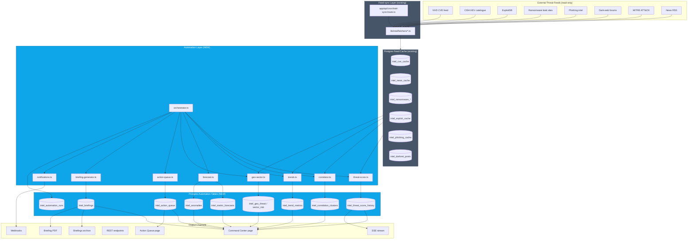

# Diagram 1 — System Architecture

Layered view of IntelForge with the new automation layer highlighted.



## Plain-text fallback

```
┌────────────────┐   ┌────────────────┐   ┌────────────────┐
│ External feeds │──▶│  intel-sync    │──▶│ Postgres feed  │
└────────────────┘   │  cron          │   │ cache (12+     │
                     └────────────────┘   │ tables)        │
                                          └────────┬───────┘
                                                   │ read
                                                   ▼
                              ┌─────────────────────────────────┐
                              │     AUTOMATION LAYER            │
                              │ orchestrator                    │
                              │   ├─ threat-score               │
                              │   ├─ correlator                 │
                              │   ├─ trends                     │
                              │   ├─ forecast                   │
                              │   ├─ geo-sector                 │
                              │   ├─ action-queue               │
                              │   ├─ briefing-generator         │
                              │   └─ notifications              │
                              └─────────────┬───────────────────┘
                                            ▼
                              ┌─────────────────────────────────┐
                              │ Postgres automation tables (9)  │
                              └─────────────┬───────────────────┘
                                            ▼
                ┌──────────┬─────────────┬──────────┬─────────┐
                ▼          ▼             ▼          ▼         ▼
              Pages     REST APIs     SSE       PDF      Webhooks
```
