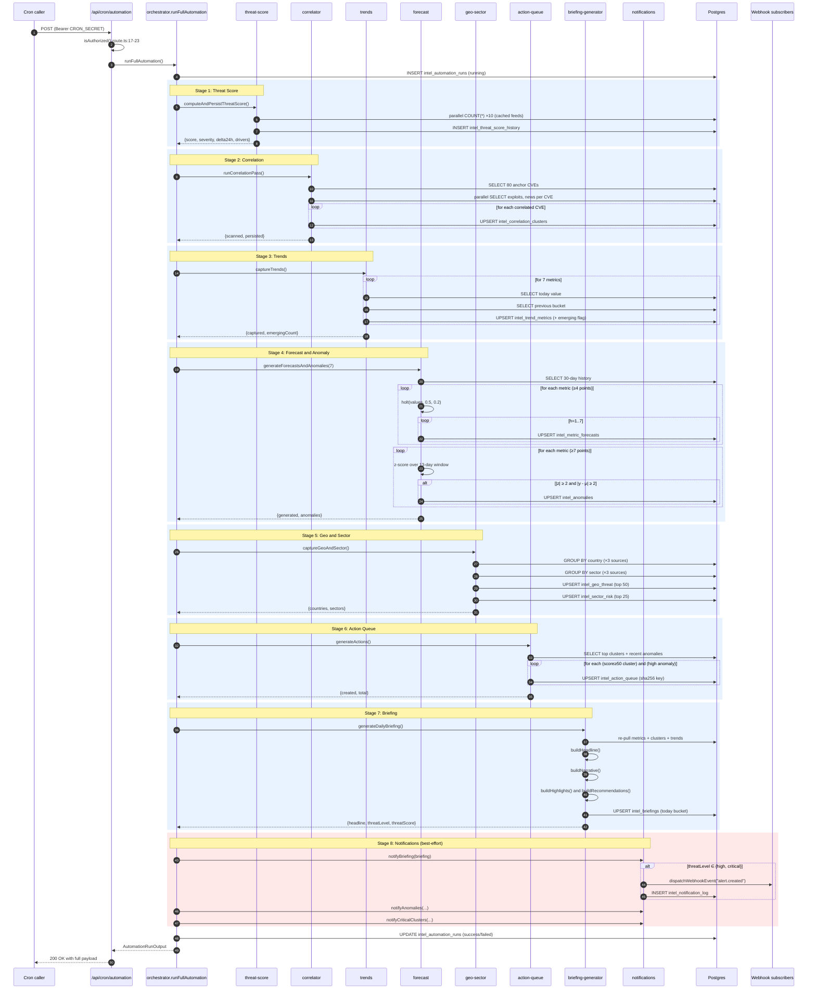

# Diagram 2 — Automation Pipeline Sequence

End-to-end sequence inside one cron cycle (`runFullAutomation` —
`lib/intel/automation/orchestrator.ts:60-179`).



## Plain-text fallback

```
Cron POST /api/cron/automation
   │
   ▼
isAuthorized()  ─┐
                 ├── 401 if CRON_SECRET mismatch (production)
                 └── proceed otherwise
   │
   ▼
runFullAutomation()  → log run start
   │
   ├──[1]── threat-score   → INSERT history snapshot
   │
   ├──[2]── correlator     → UPSERT clusters (idempotent on cluster_key)
   │
   ├──[3]── trends         → UPSERT trend buckets (idempotent on (key, date))
   │
   ├──[4]── forecast       → UPSERT forecasts + anomalies
   │
   ├──[5]── geo-sector     → UPSERT geo / sector rows
   │
   ├──[6]── action-queue   → UPSERT actions (idempotent on action_key)
   │
   ├──[7]── briefing       → UPSERT today's briefing row
   │
   └──[8]── notifications  → fire webhooks (best-effort, never blocks)

→ log run end (success / failed) + duration_ms + output payload
→ return JSON to caller
```
