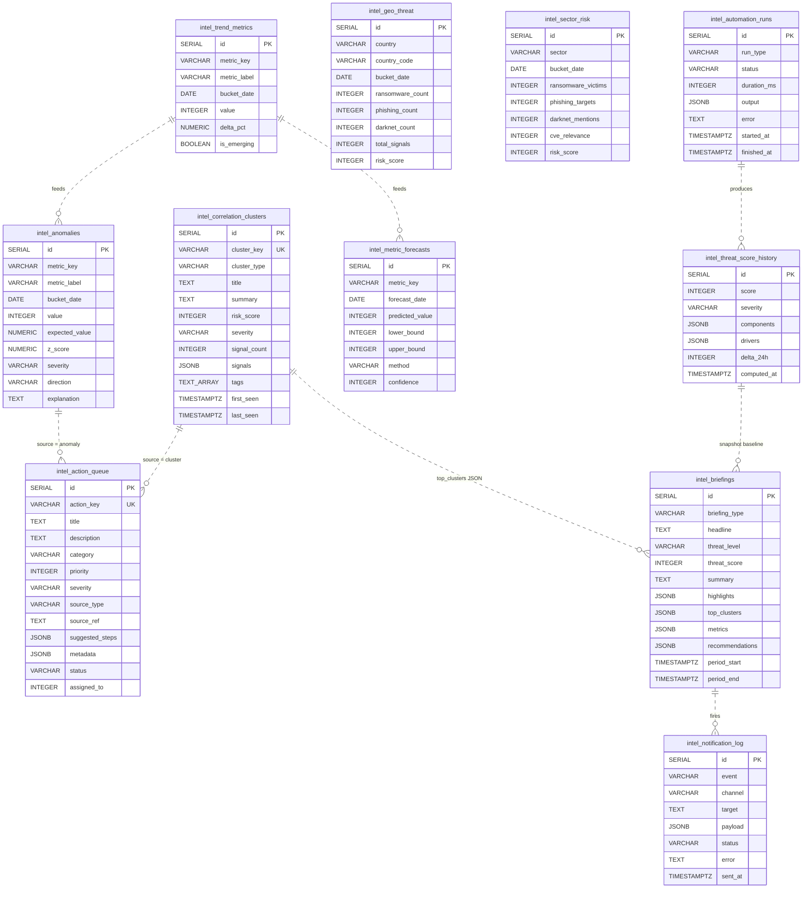

# Diagram 3 — Entity-Relationship for the Automation Layer

Only the new automation tables. The wider feed cache schema is
documented in `scripts/intel-feeds-migration.sql` and
`scripts/intel-advanced-feeds-migration.sql`.

## Idempotency contract

| Table | Unique key | Behaviour on conflict |
|-------|------------|------------------------|
| `intel_correlation_clusters` | `cluster_key` | UPDATE: title, summary, signals, last_seen |
| `intel_briefings` | `(briefing_type, period_start)` | UPDATE: headline, summary, highlights, period_end |
| `intel_trend_metrics` | `(metric_key, bucket_date)` | UPDATE: value, delta_pct, is_emerging |
| `intel_metric_forecasts` | `(metric_key, forecast_date)` | UPDATE: predicted, bounds, confidence |
| `intel_anomalies` | `(metric_key, bucket_date)` | UPDATE: value, z_score, severity |
| `intel_action_queue` | `action_key` (sha256 hash) | UPDATE: title, priority, suggested_steps |
| `intel_geo_threat` | `(country, bucket_date)` | UPDATE: counts, risk_score |
| `intel_sector_risk` | `(sector, bucket_date)` | UPDATE: counts, risk_score |
