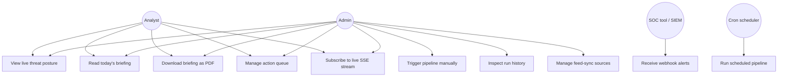

# Diagram 4 — Use Case

## Use-case → Code reference

| Use case | Page / endpoint | File |
|----------|-----------------|------|
| UC1 View live posture | `/intelligence/command-center` | `app/intelligence/command-center/page.tsx:68-580` |
| UC2 Read briefing | `/intelligence/briefings` | `app/intelligence/briefings/page.tsx:31-135` |
| UC3 Download PDF | `GET /api/intel/automation/briefings/export` | `app/api/intel/automation/briefings/export/route.ts:11-34` |
| UC4 Manage queue | `/intelligence/action-queue` + `PATCH /api/intel/automation/actions` | `app/intelligence/action-queue/page.tsx:69-326` |
| UC5 SSE stream | `GET /api/intel/automation/stream` | `app/api/intel/automation/stream/route.ts:13-65` |
| UC6 Manual run | `POST /api/admin/automation/run` | `app/api/admin/automation/run/route.ts:14-22` |
| UC7 Run history | `GET /api/admin/automation/run` | `app/api/admin/automation/run/route.ts:30-37` |
| UC8 Feed-sync triggers | `POST /api/admin/automation` | `app/api/admin/automation/route.ts:55-83` |
| UC9 Webhooks | dispatch via | `lib/intel/automation/notifications.ts:42-118` |
| UC10 Scheduled cron | `POST /api/cron/automation` | `app/api/cron/automation/route.ts:46` |
