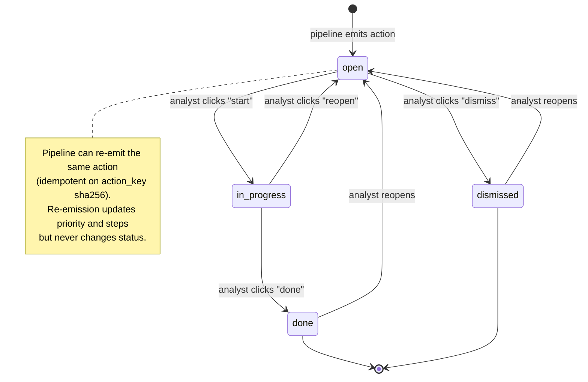

# Diagram 5 — Action Queue State Machine

Defines the legal transitions for an `intel_action_queue` row. Enforced
in `lib/intel/automation/action-queue.ts:229-244` (`updateActionStatus`)
and the UI buttons at `app/intelligence/action-queue/page.tsx:241-300`.

## State legend

| State | Meaning | UI cue |
|-------|---------|--------|
| `open` | New action awaiting triage | filter pill: Open, default colour |
| `in_progress` | Picked up by an analyst | yellow badge, "Done" button visible |
| `done` | Completed; auditable | green check, reopen available |
| `dismissed` | Triaged as non-actionable | hidden by default, reopen available |

## Hard-coded thresholds for action emission

`lib/intel/automation/action-queue.ts`:

| Source | Threshold | Line |
|--------|-----------|------|
| Cluster | `risk_score >= 50` | `action-queue.ts:80` |
| Anomaly | severity ∉ {info, low} | `action-queue.ts:138` |

The cluster threshold was intentionally lowered from 60 to 50 after
empirical measurement against the real CVE feed produced zero actions
at 60.
