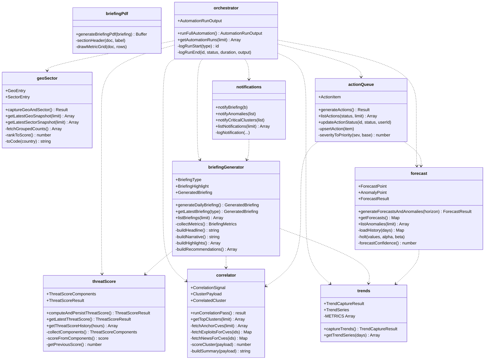

# Diagram 6 — Class / Module Structure

Modules expose pure functions (TypeScript namespaces, not classes).
This diagram shows the public exports and their dependencies.

## Boundaries

- All modules read/write through `query()` (`lib/db.ts:62-77`).
- No module calls upstream APIs at runtime.
- No module mutates global state outside Postgres.
- Each module's public surface is the `export` set; everything else
  is private to the file.
