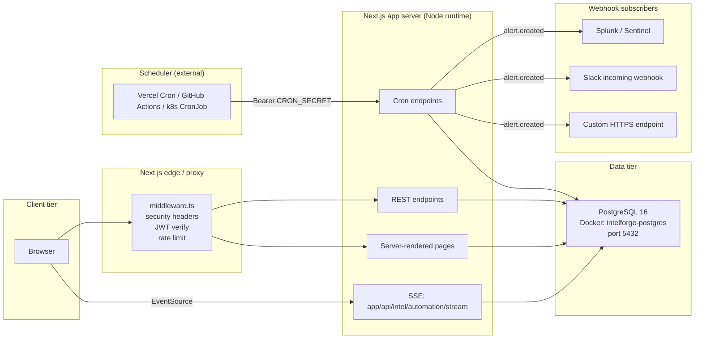

# Diagram 7 — Deployment Topology

## Environment requirements

| Component | Version | Notes |
|-----------|---------|-------|
| Node.js | ≥ 20 | required by Next 16 |
| Next.js | 16.2.4 | uses `--webpack` flag, not Turbopack |
| PostgreSQL | 16 | `intelforge-postgres` Docker image: `postgres:16-alpine` |
| Docker | any modern | only used to host Postgres |

## Required environment variables

| Variable | Used by | Notes |
|----------|---------|-------|
| `DATABASE_URL` | every module via `lib/db.ts` | must be set before migrations |
| `CRON_SECRET` | `app/api/cron/automation/route.ts:18` | reject all production calls without it |
| `JWT_SECRET` / `JWT_REFRESH_SECRET` | `lib/jwt.ts` | reused for admin endpoints |
| `SESSION_SECRET` | `lib/secure-session.ts` | reused |
| `RESPONSE_SIGNING_SECRET` | `lib/response-signing.ts` | reused |

All secrets must be 64-character random hex. See
`scripts/generate-jwt-secrets.js` for a generator.

## Production hardening checklist

- [x] All cron endpoints require `Bearer CRON_SECRET`
- [x] Admin endpoints re-fetch the user from DB (`lib/middleware.ts:55`)
- [x] CSRF token required on action-queue mutations
- [x] No upstream provider names exposed in UI
- [x] Parameterised SQL everywhere (no string interpolation)
- [x] PDFKit declared as `serverExternalPackages` so AFM fonts ship
- [x] SSE handles client abort cleanly (no leaked intervals)
- [x] All migrations idempotent; safe re-run after partial failure
